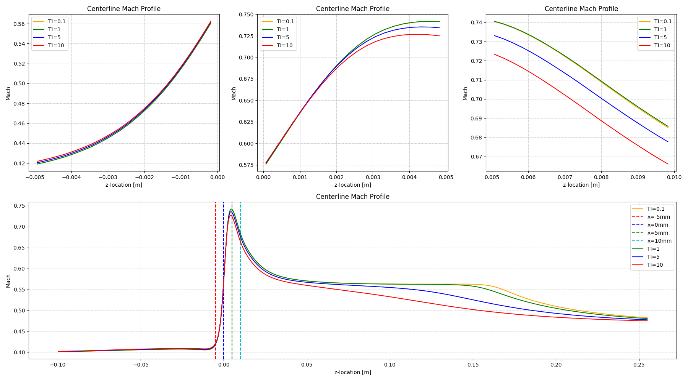
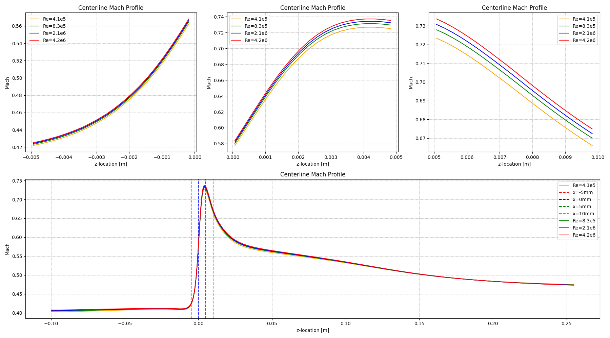
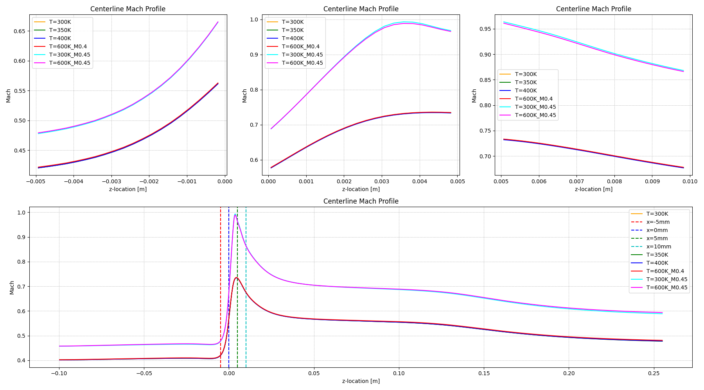
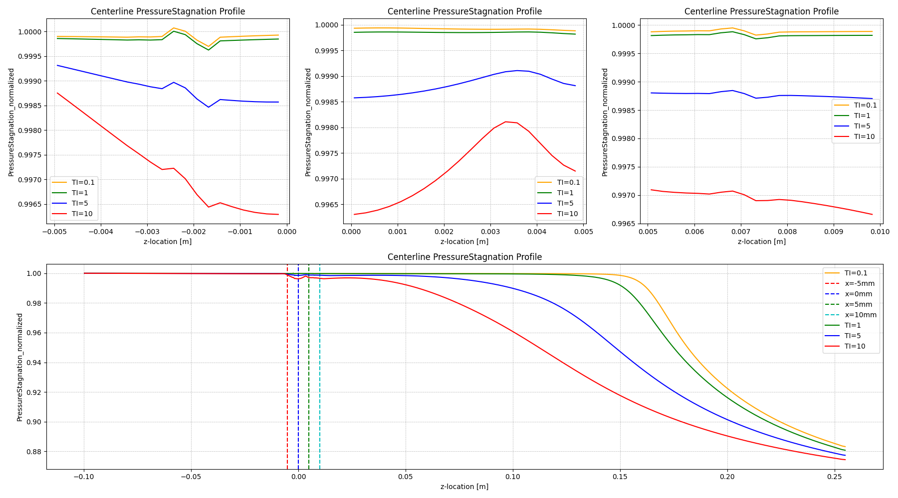
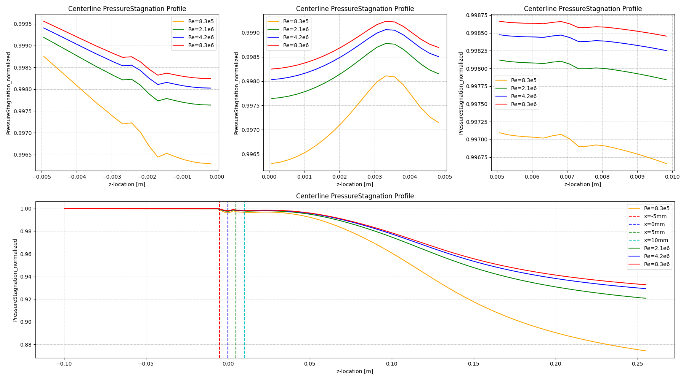
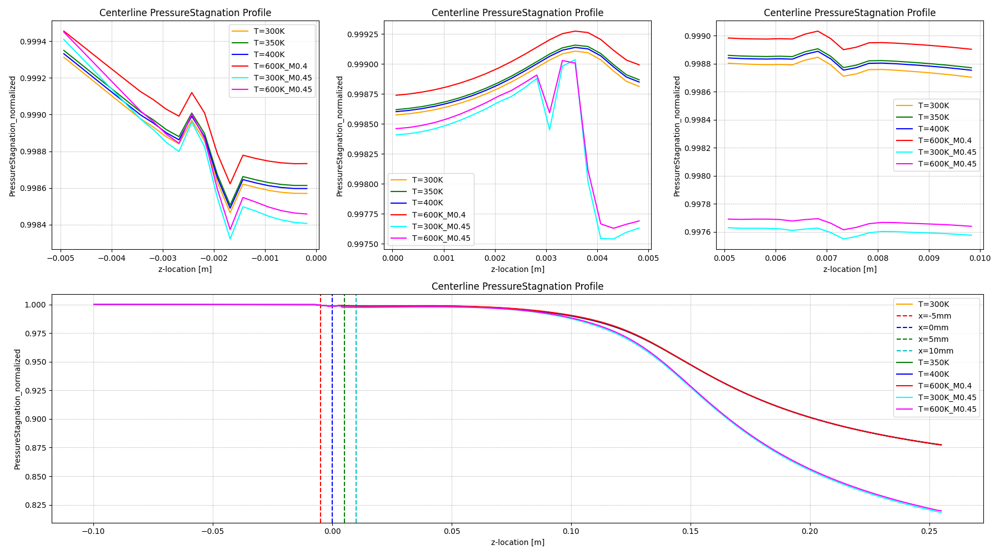
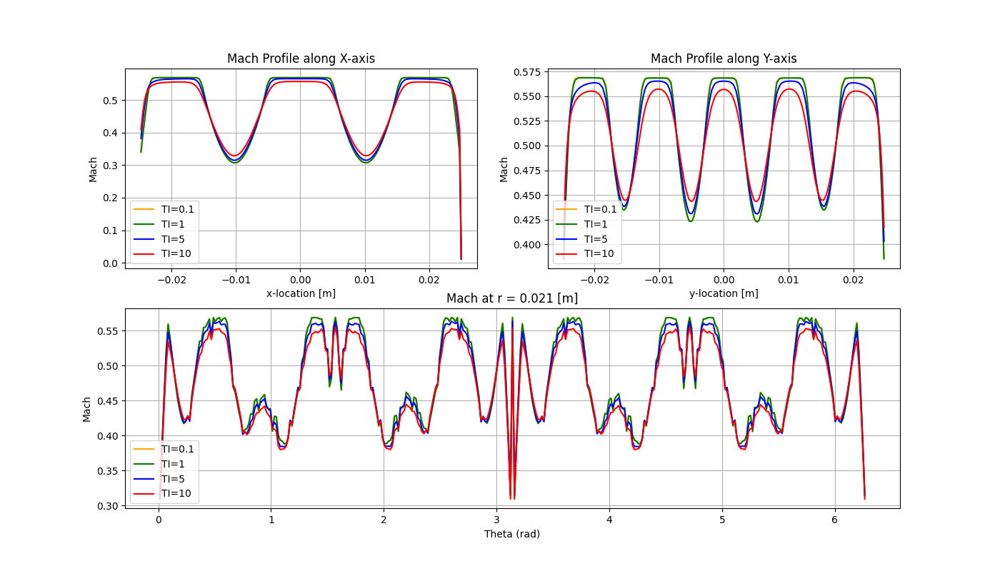
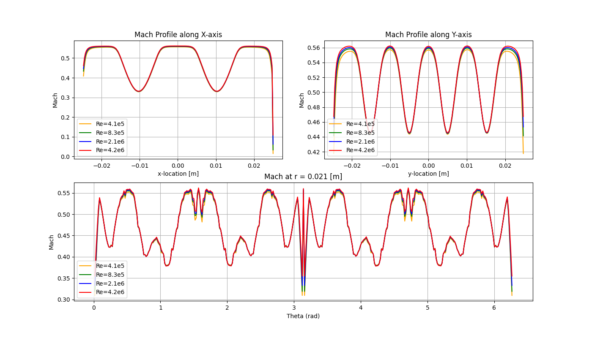
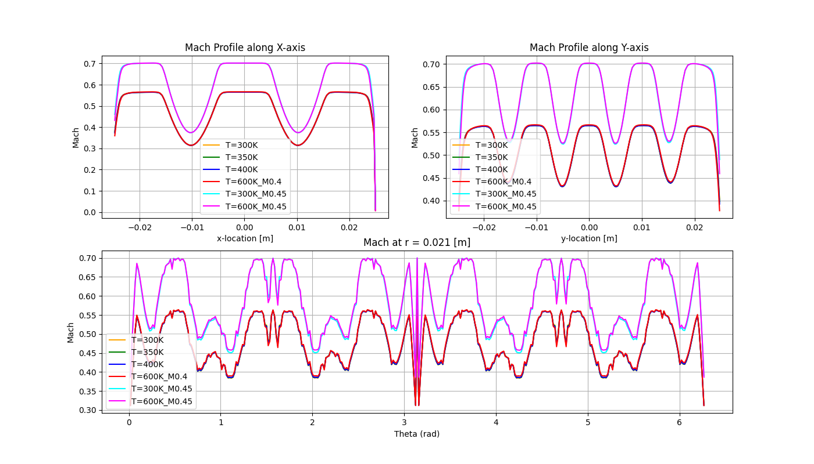
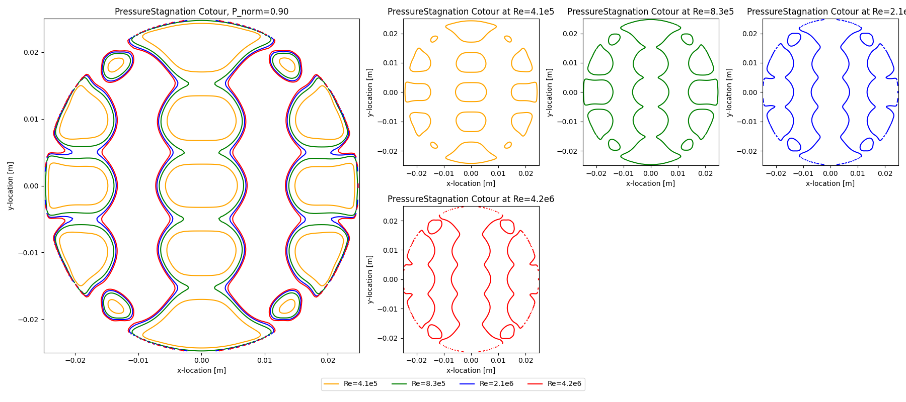

# Automated CFD Post-Processing & Sensitivity Analysis Pipeline

This repository showcases an end-to-end automated pipeline for extracting, processing, and visualising high-volume computational fluid dynamics (CFD) data. Using **Ansys Fluent**, **Python (PyVista/SciPy)**, and **Matplotlib**, the project analyses flow field sensitivity across varying Mach numbers, Reynolds numbers, Turbulence Intensities (TI), and Temperatures.

## Project Overview

The core challenge addressed here is the efficient analysis of multiple CFD simulation cases. Instead of manual post-processing, this project utilises:
1.  **Fluent Automation**: Python-generated Journal files to batch-export 2D surface data in `.cgns` format.
2.  **Data Processing**: A custom Python library to handle 3D mesh interpolation, coordinate transformations (Cartesian to Polar), and normalisation.
3.  **Visualisation**: Automated generation of comparative plots to identify physical trends in wakes and pressure drops.

---

## Technical Stack
*   **Simulation**: Ansys Fluent (v23.2)
*   **Automation**: Python (Subprocess, Pathlib)
*   **Data Handling**: PyVista (VTK-based mesh processing), NumPy, SciPy (Linear Interpolation)
*   **Visualisation**: Matplotlib (Multi-axis subplots)

---

## Analysis & Visualization Explained

The pipeline generates three primary types of visualisations to characterise the flow through a perforated screen.

### 1. Centerline Profiles (Axial Development)

1. Mach Profile Centerlines

<table style="width: 100%; border: none;">
  <tr style="border: none;">
    <td align="center" style="border: none;"> Turbulence Intensity sweep</td>
    <td align="center" style="border: none;"> <b>Reynolds number sweep</td>
    <td align="center" style="border: none;"> Temperature sweep</td>
  </tr>
</table>

2. Normalised Stagnation Pressure Centerline

<table style="width: 100%; border: none;">
  <tr style="border: none;">
    <td align="center" style="border: none;"> Turbulence Intensity sweep</td>
    <td align="center" style="border: none;"> <b>Reynolds number sweep</td>
    <td align="center" style="border: none;"> Temperature sweep</td>
  </tr>
</table>

These plots track the evolution of the flow along the $Z$-axis (flow direction).
*   **What it shows**: The transition from inlet conditions through a perforated screen (at $z=0$) into the downstream recovery region.
*   **Key Insight**: The Mach number plots reveal the local acceleration as the flow is constricted through the "screen" geometry.
By normalising the Stagnation Pressure, we can precisely quantify the grid's pressure loss coefficient. 
### 2. Downstream Spatial Profiles (X-Y & Polar)

1. Mach Profile downstream

<table style="width: 100%; border: none;">
  <tr style="border: none;">
    <td align="center" style="border: none;"> Turbulence Intensity sweep</td>
    <td align="center" style="border: none;"> <b>Reynolds number sweep</td>
    <td align="center" style="border: none;"> Temperature sweep</td>
  </tr>
</table>

2. Normalised Stagnation Pressure downstream

<table style="width: 100%; border: none;">
  <tr style="border: none;">
    <td align="center" style="border: none;"> Turbulence Intensity sweep</td>
    <td align="center" style="border: none;"> <b>Reynolds number sweep</td>
    <td align="center" style="border: none;"> Temperature sweep</td>
  </tr>
</table>

Flow data is extracted from 2D slices downstream of the disturbance.
*   **Cartesian Profiles**: These 2D slices 1D downstream (50mm) of the screen show the periodic Mach deficits caused by the grid.
*   **Polar Profiles**: Mach is sampled at a constant radius ($r = 0.021m$). 
*   **Key Insight**: This is critical for identifying **azimuthal non-uniformity**. It proves whether the flow distorts more in the centre or near the duct walls.

### 3. Normalised Stagnation Pressure Contours
Combined contour plots (Reynolds sweep)

A comparative look at how Reynolds Number ($Re$) affects the distortion.
*   **What it shows**: Iso-contours of $P_{norm} = 0.90$. 
*   **Key Insight**: As the Reynolds number increases, the "islands" of pressure deficit change shape. This visualises the sensitivity of the generated distortion with the Reynolds number.

---

## Code Structure

### `Fluent_data_export.py`
Automates the "boring" part. Creating 10+ surfaces on 21+ different cases, each manually, is a labour-intensive, time-consuming process that would take 10+ hours. This code automates the complete process, saving time and effort. It iterates through 21+ simulation case files, creates plane surfaces at specific $d$ (diameters) upstream and downstream, and exports variables (Velocity, Mach, Pressure) to CGNS format in just 3 hours.

### `Post_processing_functions.py`
The mathematical engine of the project:
*   **`load_meshes()`**: Efficiently organises and loads dozens of CGNS files into PyVista objects.
*   **`griddata` Interpolation**: Maps unstructured CFD data onto a uniform grid for clean plotting.
*   **Modular Plotters**: Functions like `downstream_plot` and `centerline_plot` allow the same logic to be applied to any variable (Mach, TI, etc.) with a single call.

### `Post-processing.py`
The main execution script. It manages the metadata (labels, folder structures) and triggers the visualisation suite for each study (Mach analysis, Re analysis, etc.).

---

## Key Results Highlight
*   **Reynolds Sensitivity**: The analysis revealed that higher Reynolds numbers result in spread out pressure field which implies inlet distortion is a function of the Reynolds number.
*   **Temperature Effects**: Mach number profiles remained consistent across temperatures when normalised, confirming the robustness of the non-dimensional analysis.
*   **Automation Efficiency**: Reduced post-processing time from 10+ hours of manual labor to a **3-hours automated execution**.

---

## How to Use
1.  **Export**: Run `Fluent_data_export.py` (requires Ansys Fluent installed).
2.  **Process**: Ensure data is in the `/Data-analysis_files/` folder.
3.  **Visualize**: Run `Post-processing.py` to generate all plots in the `/Data-analysis_results/` directory.
